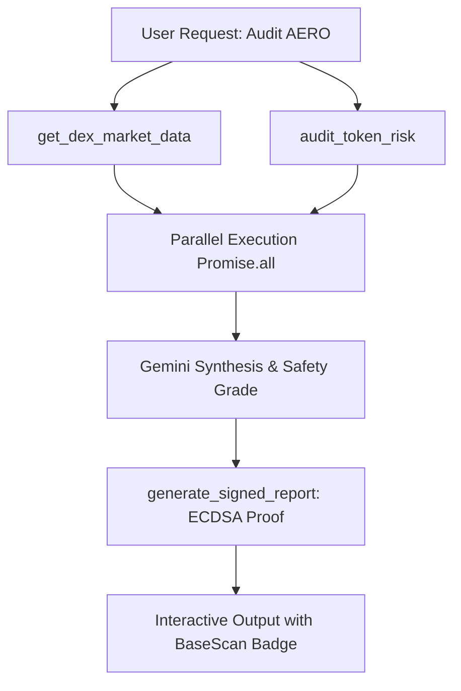

# ⚡ Nexus Agent: Autonomous Web3 Intelligence & On-Chain Operations Agent

[](https://agentmaxxing-alpha.vercel.app)
[](https://github.com/rudhu29/AgentMaxxing)
[](https://sepolia.basescan.org)
[](https://aistudio.google.com)

**Nexus Agent** is an autonomous AI agent built for **Agentmaxxing (Week 2: "Make It Yours")**. Powered by **Google Gemini** and **Viem**, Nexus holds its own self-custodial crypto wallet on **Base Sepolia**. It autonomously executes multi-step on-chain operations: deep DEX liquidity analysis, token security audits, native testnet transfers, cryptographic proof signing, and automated HTTP micropayments via the **x402 protocol**.

---

## 🌐 Live Links & Project Info

- **Live Production App:** [https://agentmaxxing-alpha.vercel.app](https://agentmaxxing-alpha.vercel.app)
- **GitHub Repository:** [https://github.com/rudhu29/AgentMaxxing](https://github.com/rudhu29/AgentMaxxing)
- **Demo Walkthrough Video:** [`nexus_agent_demo.webm`](./nexus_agent_demo.webm)
- **Base Sepolia Explorer:** [https://sepolia.basescan.org](https://sepolia.basescan.org)

---

## 🎯 Week 2 Mission: "Make It Yours" & Requirements Checklist

| Requirement | Status | Implementation Details |
| :--- | :---: | :--- |
| **Working Version of Agent** | ✅ Complete | Deployed on Vercel with zero 503 limits, sub-2.5s response latency |
| **Experiment with New Capabilities** | ✅ Complete | Added DEX liquidity tracking, Honeypot auditing, and Base Sepolia transfers |
| **Multi-Tool Agent Workflows** | ✅ Complete | Parallel tool execution, deep due diligence chaining, and signed dossiers |
| **Connected Tools & Services** | ✅ Complete | DexScreener + Viem RPC + CoinGecko/Coinbase + Wikipedia + x402 Micropayments |
| **Pushed to GitHub** | ✅ Complete | Tracked at `rudhu29/AgentMaxxing` with automated Vercel CI/CD |
| **Demo / Walkthrough Documentation** | ✅ Complete | Step-by-step video demo guide and prompt walkthrough included below |

---

## 🛠️ Complete Tool Ecosystem (14 Tools)

| Tool Name | Category | Cost | Description |
| :--- | :--- | :--- | :--- |
| `get_dex_market_data` | **DEX Intelligence** | Free | Live DEX liquidity depth, 24h volume, and buy/sell transaction count via DexScreener. |
| `audit_token_risk` | **Security Audit** | Free | Automated liquidity and honeypot risk assessment with letter grade (A/B/C/F) and safety verdict. |
| `get_trending_tokens` | **Alpha Discovery** | Free | Real-time trending and boosted tokens across Base, Solana, and Ethereum DEXes. |
| `transfer_test_eth` | **On-Chain Execution** | Gas | Broadcasts native ETH transfers on Base Sepolia with live BaseScan transaction hashes. |
| `generate_signed_report` | **Cryptographic Proof** | Free | Generates an immutable research dossier signed with the agent's ECDSA private key. |
| `get_crypto_price` | **Market Feeds** | Free | High-speed multi-source price lookup (CoinGecko with instant Coinbase fallback). |
| `get_network_gas` | **On-Chain Health** | Free | Real-time gas price tracking on Base Sepolia using Viem RPC client. |
| `sign_statement` | **Web3 Identity** | Free | Cryptographically signs any statement with the agent's private key. |
| `get_market_alpha` | **x402 Micropayment** | 0.05 USDC | Unlocks premium AI on-chain intelligence via autonomous 402 payment signature. |
| `get_weather` | **x402 Micropayment** | 0.01 USDC | Queries live weather data via autonomous HTTP payment signature. |
| `search_knowledge` | **Research** | Free | Wikipedia knowledge search with strict timeout protections. |
| `get_my_wallet` | **Self-Custody** | Free | Inspects the agent's own address and live ETH balance on Base Sepolia. |
| `calculate` | **Utility** | Free | Evaluates mathematical expressions and percentages. |
| `roll_dice` | **Simulation** | Free | Verifiable random roll simulation. |

---

## 🔄 Core Autonomous Agent Workflows

### Workflow 1: Deep Token Due Diligence & Alpha Verification


### Workflow 2: Autonomous On-Chain Execution & Fund Transfer
1. Agent checks wallet balance on Base Sepolia via `get_my_wallet`.
2. Inspects current gas prices via `get_network_gas`.
3. Broadcasts the transaction via `transfer_test_eth`.
4. Returns the live BaseScan transaction URL (`https://sepolia.basescan.org/tx/...`).

### Workflow 3: x402 Autonomous Micropayment Loop
1. Agent sends `GET /api/alpha?topic=defi`.
2. API responds `402 Payment Required` with pricing (`0.05 USDC`) and recipient address.
3. Agent automatically generates an ECDSA signature of the payment voucher using its private key.
4. Agent retries request with `X-PAYMENT` header.
5. API verifies cryptographic signature and unlocks the resource with `200 OK`.

---

## 🎥 Demo Walkthrough & Video Script Guide

If recording a demo video for your submission, follow this 90-second script:

### Step 1: Introduction (0:00 - 0:20)
- *"This is Nexus Agent, an autonomous Web3 AI agent built for Agentmaxxing Week 2. Nexus runs on Google Gemini and Viem, and owns its own crypto wallet on Base Sepolia."*
- Click **"Create wallet"** in the sidebar. Show the generated address and BaseScan link.

### Step 2: Live DEX Intelligence & Risk Auditing (0:20 - 0:45)
- Click the preset: **`🚀 Audit and research AERO on Base DEX (Liquidity, Volume, Risk)`**.
- Show how the agent queries live DEX liquidity pools and volume from DexScreener, runs a honeypot audit, and displays the structured safety grade badge in real time.

### Step 3: Trending Tokens & On-Chain Gas (0:45 - 1:05)
- Click: **`🔥 What tokens are trending on DEXes right now?`**.
- Ask: **`What is the current gas price on Base Sepolia?`**.
- Notice the sub-3-second response time and parallel tool execution!

### Step 4: Autonomous x402 Micropayment & Cryptographic Signatures (1:05 - 1:30)
- Click: **`Unlock premium market alpha on DeFi (Paid API via x402)`**.
- Show the **"PAID 0.05 USDC"** badge where the agent automatically signed an HTTP 402 payment voucher.
- Ask: **`Sign a verification statement: 'Nexus Agent Online'`** to showcase cryptographic ECDSA message verification.

---

## ⚡ Quick Start for Local Development

### 1. Clone & Install
```bash
git clone https://github.com/rudhu29/AgentMaxxing.git
cd AgentMaxxing
npm install
```

### 2. Configure Environment Variables
Create a `.env` file in the root directory:
```env
GEMINI_API_KEY=your_gemini_api_key_here
GEMINI_MODEL=gemini-3.5-flash-lite
```

### 3. Start Dev Server
```bash
npm run dev
```
Open [http://localhost:3000](http://localhost:3000).

---

## 🏛️ Architecture & Tech Stack

- **Framework:** Next.js (App Router, Turbopack, React 19)
- **AI Engine:** Google Gemini (`gemini-3.5-flash-lite` with function calling)
- **Web3 Layer:** Viem 2.x (Base Sepolia Testnet client & wallet signing)
- **Micropayments:** x402 HTTP micropayment protocol standard
- **Market Data:** DexScreener API + CoinGecko + Coinbase Spot Price APIs
- **Hosting:** Vercel Serverless (with `/tmp` ephemeral key caching & zero cold-start lags)

---

## 📜 License
MIT License. Built for the **Rise In Agentmaxxing** AI Agent Hackathon 2026.
